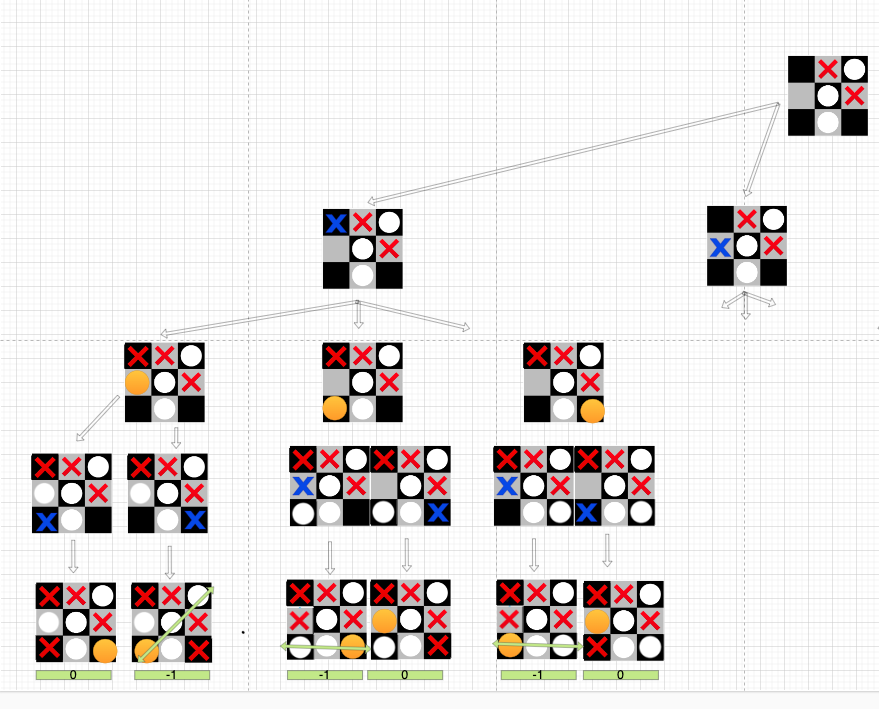

# JogoDaVelhaJs

Rolou uma Issue no grupo de programação:
https://www.facebook.com/groups/panelinhadoalgoritmo/permalink/711655205651823/

E acabei ficando curioso de como funciona um mecanismo de:
- Tabuleiro
- Verificação de quem ganhou
- a maquina fazer uma jogada/interagir (simples)
Acabei implementando.

Obs: Está sem I.A.
Meu objetivo era só fazer a estruturação basica.

Você pode ver o Demo aqui:
https://gabrieldarezzo.github.io/Jogo-da-VelhaJS/index.html

Obs: Caso queira entender mais sobre IA, referencias legais: 
- https://www.youtube.com/watch?v=trKjYdBASyQ
- https://pt.wikipedia.org/wiki/Minimax

E uma foto que fiz estudando essa algoritmo: 

